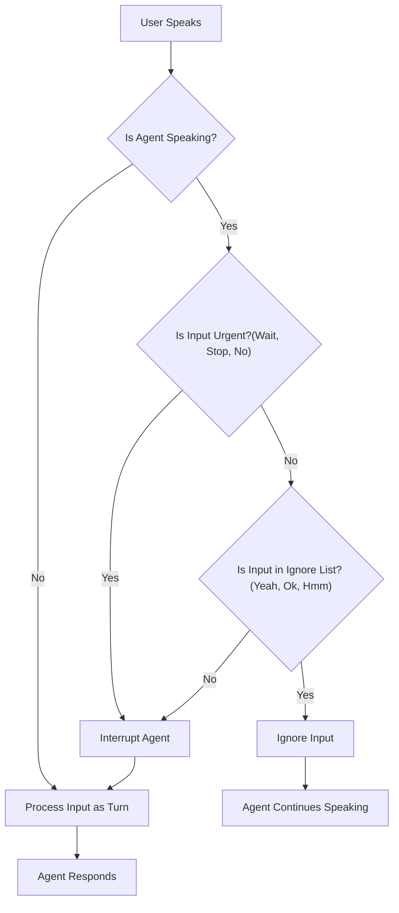

# LiveKit Intelligent Interruption Handling - Implementation Report
## 📝 Overview
This report details the implementation of the context-aware interruption logic for the LiveKit voice agent. The system now intelligently distinguishes between passive acknowledgments (backchanneling) and active interruptions based on the agent's state and the semantic content of the user's speech.
## 🎯 Core Logic Implementation
We have implemented a logic layer within the agent's event loop (`AgentActivity`) that handles user input based on the following matrix:
| User Input | Agent State | Behavior | Implementation Detail |
| :--- | :--- | :--- | :--- |
| **"Yeah / Ok / Hmm"** | **Speaking** | **IGNORE** | Input is split into words. If *all* words match `interruption_speech_filter`, it is ignored. (e.g. "Yeah ok" is ignored). |
| **"Wait / Stop / No"** | **Speaking** | **INTERRUPT** | Input matches `urgent_keywords` list. Agent stops immediately. |
| **"Yeah / Ok / Hmm"** | **Silent** | **RESPOND** | Filter only applies when `current_speech` is active. Input is processed as a turn. |
| **"Start / Hello"** | **Silent** | **RESPOND** | Standard VAD/STT processing. |
### Key Features
1.  **Configurable Ignore List (`interruption_speech_filter`)**:
    *   A list of "soft" words is passed to the `AgentSession`.
    *   Current list: `["yeah", "ok", "okay", "uh huh", "uh-huh", "hmm", "hm", "yep", "right", "um hm", "mhm", "mhmm"]`
    *   These words are ignored *only* when the agent is speaking.
2.  **Urgent Keyword Handling**:
    *   We implemented a check for "urgent" keywords that bypasses the ignore list.
    *   Keywords: `["wait", "stop", "hold on", "no"]` and phrases like `"wait a sec"`.
    *   If any of these are detected, the agent interrupts immediately, even if the sentence also contains "yeah" (e.g., "Yeah wait").
3.  **State-Based Filtering**:
    *   The logic checks `self._current_speech` to determine if the agent is currently speaking.
    *   If the agent is silent, the ignore list is skipped, allowing the agent to respond to short affirmations like "Yeah" (e.g., answering "Are you ready?").
## 📊 Logic Flowchart

## 🎥 Demo
Watch the implementation in action:
**[YouTube Demo Link](https://youtu.be/cF4kLmyEt5U)**

## 📂 Code References
The core logic is implemented in `livekit/agents/voice/agent_activity.py`:
```python
# Urgent keywords check
urgent_keywords = ["wait", "stop", "hold on", "no"]
is_urgent = any(w in normalized_text.split() for w in urgent_keywords) or "wait a sec" in normalized_text
if not is_urgent:
    if opt.interruption_speech_filter:
        # Check if text matches ignore list
        if normalized_text in [w.lower().strip() for w in opt.interruption_speech_filter]:
            return # Ignore
```
And configured in `examples/voice_agents/basic_agent.py`:
```python
session = AgentSession(
    # ...
    interruption_speech_filter=["yeah", "ok", "okay", "uh huh", "hmm", ...],
)
```