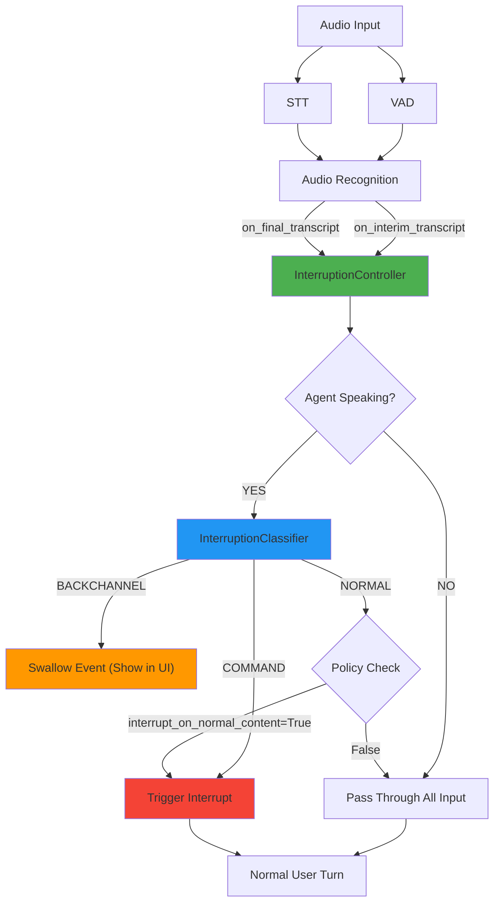

# Semantic Interruption Handling for LiveKit Agents

## Demo Video Link

[Demo Video Link Here](https://drive.google.com/file/d/17U6Vh20zr3VTd4XOv6uQ3YKwhn9wQC2e/view?usp=drivesdk)

## Overview

This implementation provides **intelligent interruption control** for LiveKit voice agents that distinguishes between passive backchannel feedback and active interruptions based on conversation context.

### The Problem

Traditional VAD (Voice Activity Detection) based interruption is too aggressive:
- User saying "yeah" or "hmm" while agent speaks → Agent stutters/pauses unnecessarily
- VAD triggers before STT completes → Race conditions and timing glitches
- No semantic understanding → Can't distinguish "yeah" from "stop"

### The Solution

**Semantic interruption handling** that:
- Ignores backchannel - Agent continues smoothly when user says "yeah", "ok", "hmm"
- Interrupts on commands - Agent stops immediately on "stop", "wait", "no"
- Context-aware - Same word ("yeah") behaves differently based on agent state
- Zero hiccups - VAD-disabled mode eliminates timing races
- Fully configurable - Customize word lists and policies

---

## Architecture

### Component Diagram



### Module Structure

```
livekit-agents/livekit/agents/voice/interruption/
├── __init__.py              # Package exports
├── config.py                # InterruptionConfig dataclass
├── classifier.py            # InterruptionClassifier + UtteranceType enum
└── controller.py            # InterruptionController + InterruptionDecision
```

---

## Components

### 1. InterruptionConfig

Configuration with word lists and policies.

```python
@dataclass
class InterruptionConfig:
    ignore_words: set[str]              # Backchannel words to ignore
    command_words: set[str]             # Command words that interrupt
    command_phrases: set[str]           # Multi-word command phrases
    interrupt_on_normal_content: bool   # Policy for substantive content
```

**Default Backchannel Words**:
`yeah`, `ok`, `okay`, `hmm`, `mm`, `uh`, `uh-huh`, `mm-hmm`, `mhmm`, `right`, `sure`, `yep`, `yup`, `mhm`, `ah`, `oh`

**Default Command Words**:
`stop`, `wait`, `no`, `pause`, `hold`, `hang`, `interrupt`

**Default Command Phrases**:
`wait a second`, `hold on`, `hang on`, `wait up`, `stop it`, etc.

### 2. InterruptionClassifier

Text-based classification engine.

```python
class InterruptionClassifier:
    def classify(self, text: str) -> UtteranceType:
        # Returns: BACKCHANNEL, COMMAND, or NORMAL
```

**Classification Logic** (priority order):
1. **Command phrases** (substring match) → COMMAND
2. **Command tokens** (word match) → COMMAND
3. **Pure backchannel** (all words in ignore list) → BACKCHANNEL
4. **Everything else** → NORMAL

**Examples**:
- `"yeah ok hmm"` → BACKCHANNEL
- `"stop"` → COMMAND
- `"yeah but wait a second"` → COMMAND (command wins)
- `"What time is it?"` → NORMAL

### 3. InterruptionController

State-aware decision engine.

```python
class InterruptionController:
    def should_process_transcript(
        self, 
        text: str, 
        is_final: bool
    ) -> bool:
        # Returns: True to process, False to swallow
```

**Decision Matrix**:

| Agent State | User Input | Behavior |
|-------------|------------|----------|
| **Silent** | "yeah" | Normal turn (agent responds) |
| **Silent** | "stop" | Normal turn (agent responds) |
| **Speaking** | "yeah ok" | Ignored (no interruption) |
| **Speaking** | "stop" | Immediate interruption |
| **Speaking** | "yeah but wait" | Immediate interruption (command detected) |
| **Speaking** | "What time is it?" | Interruption (if policy=True) |

### 4. InterruptionDecision

Structured decision object with full context.

```python
@dataclass
class InterruptionDecision:
    should_process: bool        # Create user turn?
    should_interrupt: bool      # Interrupt agent?
    utterance_type: UtteranceType
    reason: str                 # Human-readable explanation
    matched_words: list[str]    # Words that influenced decision
```

**Benefits**:
- Transparent logging and debugging
- Test assertions on decision reasoning
- Metrics collection

---

## Usage

### Basic Setup

```python
from livekit.agents import AgentSession
from livekit.agents.voice.interruption import InterruptionConfig

# Create session with semantic interruption
session = AgentSession(
    stt="deepgram/nova-3",
    llm="openai/gpt-4o-mini",
    tts="cartesia/sonic-2.0:...",
    vad=silero.VAD.load(),
    
    # CRITICAL: Keep STT active during agent speech
    discard_audio_if_uninterruptible=False,
    
    # Enable semantic interruption with defaults
    interruption_config=InterruptionConfig(),
)

await session.start(MyAgent(), room=ctx.room)
```

### Custom Configuration

```python
# Customize word lists and policy
config = InterruptionConfig(
    ignore_words={"yeah", "ok", "mmhmm", "gotcha"},
    command_words={"stop", "wait", "pause", "cancel"},
    command_phrases={"hold on", "wait a sec", "one moment"},
    interrupt_on_normal_content=True,  # Default: allow questions to interrupt
)

session = AgentSession(
    ...,
    discard_audio_if_uninterruptible=False,
    interruption_config=config,
)
```

### Environment-Based Configuration

```python
# Set via environment variables
export INTERRUPTION_IGNORE_WORDS="yeah,ok,hmm,gotcha"
export INTERRUPTION_COMMAND_WORDS="stop,wait,pause"
export INTERRUPTION_INTERRUPT_ON_NORMAL="true"

# Load from environment
config = InterruptionConfig.from_env()
```

---

## How It Works

### VAD-Disabled Semantic Mode

The key innovation is **disabling VAD-driven interruption** when semantic mode is enabled:

```python
# In AgentActivity._interrupt_by_audio_activity()
if self._interruption_controller is not None:
    return  # NO-OP: semantic mode handles all interruptions
```

**Why This Matters**:
- VAD fires immediately on audio activity
- STT text arrives later (50-200ms delay)
- Traditional approach: VAD interrupts → STT arrives too late → race condition
- **Our approach**: Only STT semantics trigger interruptions → no race condition

### Transcript Filtering

STT events are filtered through the controller in both callbacks:

**on_interim_transcript** (fast reaction):
```python
if self._interruption_controller:
    should_process = self._interruption_controller.should_process_transcript(
        transcript, is_final=False
    )
    if not should_process:
        return  # Swallow backchannel
```

**on_final_transcript** (final decision):
```python
if self._interruption_controller:
    should_process = self._interruption_controller.should_process_transcript(
        transcript, is_final=True
    )
    self._interruption_controller.reset_utterance()  # Reset for next utterance
    if not should_process:
        # Emit event for UI visibility
        self._session._user_input_transcribed(...)
        return  # Swallow backchannel (no LLM processing)
```

### Public API for Interruptions

The controller triggers interruptions via a clean public API:

**AgentActivity.semantic_interrupt()** - Public method:
```python
def semantic_interrupt(self, reason: str = "semantic command") -> None:
    """Interrupt current speech based on semantic analysis.
    
    This is the public API for semantic interruption handling.
    Encapsulates interruption logic with logging and safety checks.
    """
    if self._current_speech is not None:
        logger.info(f"[SEMANTIC INTERRUPTION] Triggering: {reason}")
        self._current_speech.interrupt()
    else:
        logger.warning(f"[SEMANTIC INTERRUPTION] No active speech (reason: {reason})")
```

**Controller usage**:
```python
# In controller._trigger_interruption()
self.agent_activity.semantic_interrupt("command word detected")
```

**Benefits**:
- Clean separation of concerns (controller doesn't touch private members)
- Future-ready for metrics/events emission
- Transparent logging at API boundary

### Structured Logging

Every decision is logged with full context:

```
[SEMANTIC INTERRUPTION] BACKCHANNEL | Agent: speaking | Action: SWALLOW | Interrupt: False | Text: 'yeah ok' | Type: final | Reason: Pure backchannel detected while agent speaking, swallowing
```

```
[SEMANTIC INTERRUPTION] COMMAND | Agent: speaking | Action: PROCESS | Interrupt: True | Text: 'stop' | Type: interim | Reason: Command word/phrase detected while agent speaking, interrupting
```

---

## Design Rationale

### Why Semantic Over VAD?

| Aspect | VAD-Based | Semantic (Ours) |
|--------|-----------|-----------------|
| Trigger | Audio volume/energy | Text meaning |
| Speed | Instant (~0ms) | STT delay (~50-200ms) |
| Accuracy | Can't distinguish "yeah" from "stop" | Precise classification |
| Hiccups | Frequent (VAD-STT race) | **Zero** (single source of truth) |
| Configurability | Fixed threshold | Word lists + policies |

### Policy: `interrupt_on_normal_content`

**True** (default):
- Natural conversation flow
- User can ask questions mid-explanation
- Agent adapts to user interest

**False** (command-only):
- Agent completes full responses
- Only explicit commands interrupt
- Better for structured content delivery

### Trade-offs

**Advantages**:
- Zero VAD-STT timing glitches
- Semantic understanding of intent
- Transparent, debuggable decisions
- Fully configurable behavior

**Limitations**:
- 50-200ms STT delay (vs instant VAD)
- English-only word lists (default)
- Requires `discard_audio_if_uninterruptible=False`

---

## Testing

### Unit Tests

```bash
# Run classifier tests
uv run python -m pytest tests/test_interruption.py -v
# or
python -m pytest tests/test_interruption.py -v

# Run controller tests
uv run python -m pytest tests/test_interruption_controller.py -v
# or
python -m pytest tests/test_interruption_controller.py -v

# All interruption tests
uv run python -m pytest tests/test_interruption*.py -v
# or
python -m pytest tests/test_interruption*.py -v
```

**Coverage**:
- Classification logic (all paths)
- State-based filtering (speaking/silent)
- Edge cases (None safety, empty text)
- Policy handling (both True/False)

---

## Troubleshooting

### Agent Still Pauses on "yeah"

**Cause**: Semantic mode not enabled or STT not active during speech

**Fix**:
```python
session = AgentSession(
    ...,
    discard_audio_if_uninterruptible=False,  # ← CRITICAL
    interruption_config=InterruptionConfig(),  # ← Must be set
)
```

### Commands Not Interrupting

**Cause**: Word not in command list or agent not in "speaking" state

**Fix**:
1. Check word is in `config.command_words` or `config.command_phrases`
2. Verify agent state with logging
3. Add custom words if needed

### Unexpected Behavior

**Debug**:
1. Enable logging: `logging.getLogger("livekit.agents.voice.interruption").setLevel(logging.DEBUG)`
2. Check logs for decision reasons and matched words
3. Verify `interrupt_on_normal_content` policy matches expectations

---

## License

Same as LiveKit Agents library.

## Contributing

For issues or improvements, please refer to the main LiveKit Agents repository.
