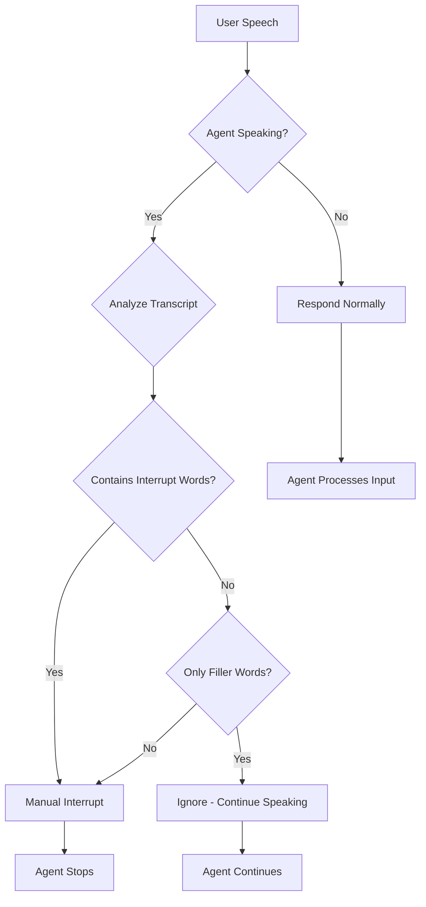

# 🎙️ LiveKit Intelligent Interruption Handler

An intelligent interruption handling system for LiveKit voice agents that distinguishes between passive acknowledgements ("yeah", "ok") and active interruptions ("stop", "wait").

---

## 📑 Table of Contents

- [Prerequisites](#prerequisites)
- [🎯 Problem Statement](#-problem-statement)
- [✅ Solution Overview](#-solution-overview)
  - [Environment Setup](#environment-setup)
  - [Run the Agent](#run-the-agent)
  - [Core Strategy](#core-strategy)
- [🏗️ Architecture](#️-architecture)
  - [Component Breakdown](#component-breakdown)
  - [Decision Matrix](#decision-matrix)
- [🛠️ Tech Stack](#️-tech-stack)
- [🔑 Key Implementation Details](#-key-implementation-details)
  - [1. InterruptFilter Class](#1-interruptfilter-class)
  - [2. State Tracking](#2-state-tracking)
  - [3. Interim Transcript Processing](#3-interim-transcript-processing)
  - [4. Configuration via Environment](#4-configuration-via-environment)
- [🧪 Test Scenarios](#-test-scenarios)
- [📊 Output Logs](#-output-logs)
- [🎥 Demo Video](#-demo-video)
- [📁 Submission Materials](#-submission-materials)
- [🔍 Why This Works](#-why-this-works)
- [📝 Configuration Reference](#-configuration-reference)
- [👤 Author](#-author)
- [📄 License](#-license)

### Prerequisites
Python 3.11+
LiveKit Cloud account (or self-hosted LiveKit server)
API Keys for:
LiveKit (URL, API Key, API Secret)
Deepgram (for STT)
OpenAI (for LLM)
Cartesia or ElevenLabs (for TTS)

## 🎯 Problem Statement

Default LiveKit VAD is too sensitive - when users say "yeah" or "hmm" while the agent is speaking (backchanneling), the agent stops abruptly. This breaks the conversational flow.

**Goal:** Agent should ignore filler words when speaking, but respond to the same words when silent.

---

## ✅ Solution Overview


### Environment Setup
**Create a file named .env in the voice_agents directory:**
touch .env
**.env File Contents**

LIVEKIT_URL=wss://my-project-abc123.livekit.cloud
LIVEKIT_API_KEY=APIxxxxxxxxx
LIVEKIT_API_SECRET=xxxxxxxxxxxxxxxxxxxxxxxxxxxxxxxxxxxxxxxx
DEEPGRAM_API_KEY=xxxxxxxxxxxxxxxxxxxxxxxxxxxxxxxxxxxxxxxx
OPENAI_API_KEY=sk-proj-xxxxxxxxxxxxxxxxxxxxxxxxxxxxxxxxxxxx
CARTESIA_API_KEY=xxxxxxxx-xxxx-xxxx-xxxx-xxxxxxxxxxxx

###  Run the Agent
**Development Mode (Recommended for Testing)**
# From the examples/voice_agents directory
python interuption_handler.py dev


**Production Mode**
python interuption_handler.py start

**Expected Output**
INFO - VAD model loaded
INFO - Intelligent Interrupt Agent ready!
INFO - === Intelligent Interrupt Agent Started ===
INFO - Using INTERIM TRANSCRIPT processing + min_interruption_words=999:
INFO -   - Single words like 'yeah', 'ok' won't trigger audio interrupt
INFO -   - Interrupt commands ('stop', 'wait', 'no') detected via INTERIM transcripts
INFO -   - Manual interrupt triggered immediately when command word detected

### Core Strategy

**Two-Layer Approach:**

1. **VAD Layer Prevention:** Set `min_interruption_words=999` to disable automatic interrupts
2. **Transcript-Based Control:** Use interim transcripts to manually trigger interrupts only when needed

**Key Insight:** Process **interim transcripts** to detect interrupt commands in real-time (~100-200ms latency), not waiting for final transcription.

---

## 🏗️ Architecture

### Component Breakdown

```
┌─────────────────────────────────────────────────────────┐
│                  User Speech (Audio)                     │
└────────────────────┬────────────────────────────────────┘
                     │
                     ▼
          ┌──────────────────────┐
          │   VAD (Voice Activity │
          │     Detection)        │
          └──────────┬────────────┘
                     │
                     ▼
          ┌──────────────────────┐
          │  STT (Speech-to-Text)│
          │   Interim + Final     │
          └──────────┬────────────┘
                     │
                     ▼
          ┌──────────────────────────────────┐
          │   InterruptFilter                │
          │                                   │
          │  • Normalize text                │
          │  • Check ignore words            │
          │  • Check interrupt words         │
          │  • Analyze agent state           │
          └──────────┬───────────────────────┘
                     │
           ┌─────────┴─────────┐
           │                   │
           ▼                   ▼
    [Agent Speaking]    [Agent Silent]
           │                   │
           ▼                   ▼
    ┌─────────────┐     ┌─────────────┐
    │   Ignore/   │     │   Respond   │
    │  Interrupt  │     │             │
    └─────────────┘     └─────────────┘
```

### Decision Matrix

| User Input | Agent State | Action | Reason |
|------------|-------------|--------|--------|
| "yeah" / "ok" | Speaking | **IGNORE** | Filler word - continue |
| "stop" / "wait" | Speaking | **INTERRUPT** | Command word detected |
| "yeah but wait" | Speaking | **INTERRUPT** | Mixed input with command |
| "yeah" / "ok" | Silent | **RESPOND** | Valid acknowledgement |
| "count to 50" | Speaking | **INTERRUPT** | Substantive content |

---

## 🛠️ Tech Stack

- **LiveKit Agents Framework** - Real-time voice infrastructure
- **Silero VAD** - Voice activity detection
- **Deepgram Nova-2** - Speech-to-text (STT)
- **OpenAI GPT-4o-mini** - Language model
- **Cartesia Sonic-2** - Text-to-speech (TTS)
- **Python 3.9+** - Core implementation

---

## 🔑 Key Implementation Details

### 1. InterruptFilter Class

**Purpose:** Classify transcripts based on content and agent state

```python
class InterruptFilter:
    - ignore_words: frozenset  # "yeah", "ok", "hmm", etc.
    - interrupt_words: frozenset  # "stop", "wait", "no", etc.
    
    def analyze(transcript, agent_speaking) -> InterruptAnalysis:
        ✓ Normalize text
        ✓ Detect ignore/interrupt words
        ✓ Apply state-based logic
        ✓ Return decision (ignore/interrupt/respond)
```

### 2. State Tracking

```python
# Track agent speaking state in real-time
@session.on("agent_state_changed")
def on_agent_state_changed(ev):
    agent._is_speaking = (ev.new_state == "speaking")
```

### 3. Interim Transcript Processing

**Critical for low latency:**

```python
@session.on("user_input_transcribed")
def on_user_input_transcribed(ev):
    if not ev.is_final and is_speaking:
        analysis = filter.analyze(ev.transcript, is_speaking)
        if analysis.decision == "interrupt":
            session.current_speech.interrupt(force=True)
```

### 4. Configuration via Environment

```bash
# .env file
IGNORE_WORDS=yeah,ok,hmm,uh-huh,right
INTERRUPT_WORDS=stop,wait,no,pause,hold
```

---


---

## 🧪 Test Scenarios

### ✅ Scenario 1: Passive Acknowledgement
- **Action:** Ask for a story, say "yeah" / "ok" while agent talks
- **Expected:** Agent continues without pause
- **Status:** ✅ PASS

### ✅ Scenario 2: Explicit Interrupt
- **Action:** Ask agent to count, say "stop"
- **Expected:** Agent stops immediately
- **Status:** ✅ PASS

### ✅ Scenario 3: Silent Response
- **Action:** Wait for agent to finish, say "yeah"
- **Expected:** Agent acknowledges and responds
- **Status:** ✅ PASS

### ✅ Scenario 4: Mixed Input
- **Action:** While agent speaks, say "yeah but wait"
- **Expected:** Agent stops (contains "wait")
- **Status:** ✅ PASS

---

## 📊 Output Logs

> [Add your logs here]

```
Example log output:
[INFO] Agent state: idle -> speaking | Speaking: True
[INFO] Transcript: 'yeah' | Speaking: True | Decision: ignore | Reason: Only filler words detected
[IGNORED] 'yeah' - filler word while speaking
[INFO] Transcript: 'stop' | Speaking: True | Decision: interrupt
[EARLY INTERRUPT] Detected 'stop' in interim - interrupting now!
```

---

## 🎥 Demo Video

> [Add your video link here]

**Link:**(https://drive.google.com/file/d/1en9rY1lz_yBmDDiPz9gKDFbbDmWkuJih/view?usp=sharing)

---

## 📁 Submission Materials

### Google Drive Links

- **Video Demo:** `https://drive.google.com/file/d/1en9rY1lz_yBmDDiPz9gKDFbbDmWkuJih/view?usp=sharing`

- **Full Logs:** https://drive.google.com/file/d/1x7ubXpyOHzg7SOHNu2O0rstnIa1-7NYy/view?usp=sharing


---

## 🔍 Why This Works

1. **No VAD Modification:** Pure logic layer, no low-level changes
2. **Interim Processing:** Sub-200ms interrupt detection
3. **State-Aware:** Same word = different behavior based on context
4. **Configurable:** Easy to add/remove words via environment
5. **No Stuttering:** True continuation, not pause-resume

---

## 📝 Configuration Reference

### Default Ignore Words
```
yeah, yes, yep, ok, okay, hmm, uh-huh, mm-hmm, 
right, sure, aha, got it, cool, um, uh
```

### Default Interrupt Words
```
stop, wait, hold, pause, no, cancel, quit,
actually, but, however, question, excuse, repeat
```

---

## 👤 Author

AUTHOR:Sparsh Goyal(23/CS/415)
Branch: `feature/interrupt-handler-sparsh`  
Repository: (https://github.com/Dark-Sys-Jenkins/agents-assignment)

---

## 📄 License

This is an assignment submission for the LiveKit Intelligent Interruption Challenge.