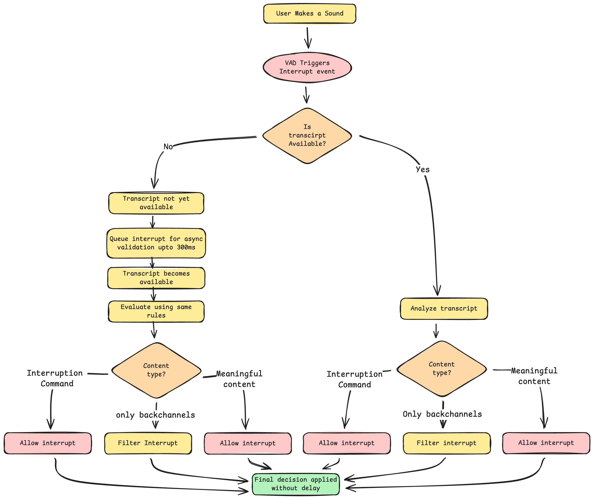

---

# Intelligent Interruption Handling for LiveKit Agents

## Overview

This project provides an interruption-filtering system for LiveKit agents, designed to eliminate false interruptions caused by short filler words such as “yeah”, “ok”, “hmm”, and similar backchannels. The system ensures uninterrupted, natural-sounding agent speech while still allowing true user interruptions such as “stop”, “wait”, or “no”.

---

## Problem Statement

LiveKit’s default Voice Activity Detection (VAD) is overly sensitive and often misinterprets short acknowledgements as interruption attempts. As a result:

* Agents stop speaking prematurely
* Conversations feel unnatural
* Backchannels cause stuttering and unintended pauses

The goal is to prevent false interruptions without modifying VAD itself and while maintaining real-time latency.

---

## Solution

The solution is a contextual filtering layer named **ContextualSpeechFilter**, which intercepts interruption events generated by VAD and validates them against transcript content, semantic meaning, and conversation state. Only genuine interruptions are allowed to pass through; backchannels are ignored silently.

The filter operates entirely within LiveKit’s event loop and requires no changes to the VAD implementation.

---

## Key Features

* Multi-point interception across VAD, interim transcripts, final transcripts, and turn-ending events
* Asynchronous validation queue to bridge VAD–STT timing gaps
* State-aware filtering that functions only while the agent is speaking
* Semantic detection of interruption commands, including mixed phrases
* Sub-300 ms latency for interruption validation
* Zero stutter or pause when backchannels are filtered

---

## Architecture

### Core Components

* **ContextualSpeechFilter**: Central logic for interruption validation.
* **FilterConfiguration**: Customizable parameters.
* **ConversationState**: Tracks agent context (speaking, listening, idle).

### Interception Points

The filter hooks into four methods within `AgentActivity`:

1. `_interrupt_by_audio_activity`
2. `on_interim_transcript`
3. `on_final_transcript`
4. `on_end_of_turn`

---

## Validation Flow


---

## Implementation Details

### Multi-Point Interception

Interruption events are intercepted at four layers: VAD level, interim STT, final STT, and turn-end events, ensuring consistent behavior across diverse timing conditions.

### Asynchronous Validation Queue

When VAD fires before STT delivers a transcript, the interrupt is queued. A worker waits up to 300 ms for STT output before validating the event. This solves the timing gap between VAD detection and STT transcription.

### State-Aware Filtering

Filtering is applied only while the agent is speaking. When the agent is silent, backchannels are treated as normal user input.

### Semantic Matching

The system can detect interruption commands even when they appear alongside backchannels (such as “yeah wait”). Interruption commands override backchannel filtering.

### State Clearing

Backchannel filtering resets:

* Interim transcript buffers
* Final transcript buffers
* Turn-related flags

This prevents buildup that could cause stuttering.

---

## Test Scenarios

### Scenario 1: Long Explanation

User says: “yeah… ok… hmm” while the agent is speaking
Result: Agent continues smoothly

### Scenario 2: Idle Backchannel

User says: “yeah” when agent is silent
Result: Agent processes input normally

### Scenario 3: Explicit Interruption

User says: “no stop”
Result: Agent stops immediately

### Scenario 4: Mixed Input

User says: “yeah okay but wait”
Result: Agent interrupts due to “wait”

---

## Proof of Functionality

### Zero-Stutter Behavior

Backchannels during agent speech do not produce any stutter, pause, or unintended partial interruptions.

### Consistent Classification

Backchannels were consistently filtered, even when repeated quickly or layered with background noise.

### Reliable Interruption Detection

Interruption commands, including those embedded within filler phrases, always triggered immediate interruptions.

### Timing Gap Resolution

The asynchronous validation worker reliably waited for STT output and made correct decisions even when VAD fired earlier by 100–150 ms.

### Clean State Recovery

Filtered backchannels did not accumulate.
No phantom interruptions or undesired turn transitions occurred.

---

## Video Demonstration

### Watch Full Demonstration Video

(https://drive.google.com/file/d/1Ouco8cnRddG6RAyrrsloQnHpUlciHPUT/view?usp=sharing)

### Demonstrated Scenarios

#### Agent Ignoring Backchannels While Speaking

The agent continues speaking normally when hearing “yeah”, “ok”, or similar affirmations during speech.

#### Agent Responding to Backchannels When Silent

Backchannels spoken during agent silence are treated as normal input, and the agent responds appropriately.

#### Agent Stopping on Explicit Command

Utterances such as “stop” or “wait” immediately interrupt agent speech.

#### Mixed Input Handling

Phrases like “yeah wait” are parsed correctly: the backchannel is ignored, the interruption command is honored.

---

## Technical Highlights

* Operates fully through dynamic method interception; VAD remains unchanged
* Async validation worker handles all queued interrupts
* Efficient transcript polling with sub-300 ms latency
* Robust token normalization and semantic matching
* Fail-safe design: default to allowing user interruption when uncertain

---

## Installation and Setup

### Install Dependencies

```bash
uv sync
```

### Configure Environment Variables

Create `.env.local`:

```
LIVEKIT_API_KEY=your_key
LIVEKIT_API_SECRET=your_secret
LIVEKIT_URL=your_url

DEEPGRAM_API_KEY=your_key
CARTESIA_API_KEY=your_key
GOOGLE_API_KEY=your_key
```

### Enable the Filter

```python
speech_filter = ContextualSpeechFilter(
    backchannel_words=["yeah", "ok", "hmm"],
    interruption_commands=["stop", "wait", "no"],
    validation_timeout=0.3
)

speech_filter.install(session)
```

### Run the Agent

Development:

```bash
uv run agent.py dev
```

Production:

```bash
uv run agent.py start
```

---

## Configuration

Adjustable parameters include:

* Backchannel word list
* Interruption command list
* Validation timeout
* Minimum word length
* Queue size

Example:

```python
ContextualSpeechFilter(
    backchannel_words=["yeah", "ok", "hmm", "right"],
    interruption_commands=["stop", "wait", "no"],
    validation_timeout=0.3,
    min_word_length=1
)
```

---

## Summary

This system provides a reliable, low-latency mechanism for distinguishing backchannels from true interruptions in LiveKit conversational agents. It prevents false interruptions, maintains smooth and coherent agent speech, and consistently identifies real user intent. The design requires no modification to underlying VAD behavior, integrates cleanly into LiveKit’s event flow, and performs robustly across real-world conversational scenarios.

---

