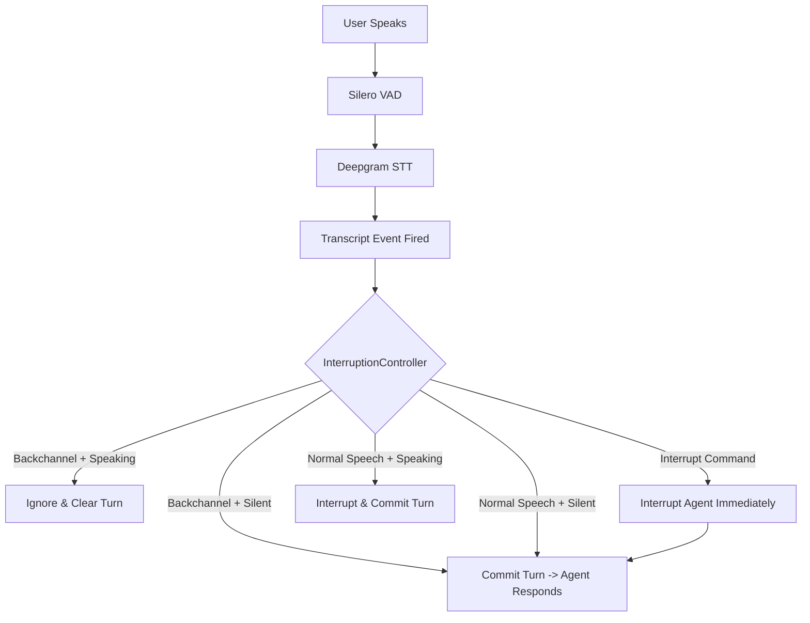

# Voice Agents Examples

This directory contains a comprehensive collection of voice-based agent examples demonstrating various capabilities and integrations with the LiveKit Agents framework.

## 📋 Table of Contents

### 🚀 Getting Started

- [`basic_agent.py`](./basic_agent.py) - A fundamental voice agent with metrics collection

### 🛠️ Tool Integration & Function Calling

- [`annotated_tool_args.py`](./annotated_tool_args.py) - Using Python type annotations for tool arguments
- [`dynamic_tool_creation.py`](./dynamic_tool_creation.py) - Creating and registering tools dynamically at runtime
- [`raw_function_description.py`](./raw_function_description.py) - Using raw JSON schema definitions for tool descriptions
- [`silent_function_call.py`](./silent_function_call.py) - Executing function calls without verbal responses to user
- [`long_running_function.py`](./long_running_function.py) - Handling long running function calls with interruption support

### ⚡ Real-time Models

- [`weather_agent.py`](./weather_agent.py) - OpenAI Realtime API with function calls for weather information
- [`realtime_video_agent.py`](./realtime_video_agent.py) - Google Gemini with multimodal video and voice capabilities
- [`realtime_joke_teller.py`](./realtime_joke_teller.py) - Amazon Nova Sonic real-time model with function calls
- [`realtime_load_chat_history.py`](./realtime_load_chat_history.py) - Loading previous chat history into real-time models
- [`realtime_turn_detector.py`](./realtime_turn_detector.py) - Using LiveKit's turn detection with real-time models
- [`realtime_with_tts.py`](./realtime_with_tts.py) - Combining external TTS providers with real-time models

### 🎯 Pipeline Nodes & Hooks

- [`fast-preresponse.py`](./fast-preresponse.py) - Generating quick responses using the `on_user_turn_completed` node
- [`flush_llm_node.py`](./flush_llm_node.py) - Flushing partial LLM output to TTS in `llm_node`
- [`structured_output.py`](./structured_output.py) - Structured data and JSON outputs from agent responses
- [`speedup_output_audio.py`](./speedup_output_audio.py) - Dynamically adjusting agent audio playback speed
- [`timed_agent_transcript.py`](./timed_agent_transcript.py) - Reading timestamped transcripts from `transcription_node`
- [`inactive_user.py`](./inactive_user.py) - Handling inactive users with the `user_state_changed` event hook
- [`resume_interrupted_agent.py`](./resume_interrupted_agent.py) - Resuming agent speech after false interruption detection
- [`toggle_io.py`](./toggle_io.py) - Dynamically toggling audio input/output during conversations

### 🤖 Multi-agent & AgentTask Use Cases

- [`restaurant_agent.py`](./restaurant_agent.py) - Multi-agent system for restaurant ordering and reservation management
- [`multi_agent.py`](./multi_agent.py) - Collaborative storytelling with multiple specialized agents
- [`email_example.py`](./email_example.py) - Using AgentTask to collect and validate email addresses

### 🔗 MCP & External Integrations

- [`web_search.py`](./web_search.py) - Integrating web search capabilities into voice agents
- [`langgraph_agent.py`](./langgraph_agent.py) - LangGraph integration
- [`mcp/`](./mcp/) - Model Context Protocol (MCP) integration examples
  - [`mcp-agent.py`](./mcp/mcp-agent.py) - MCP agent integration
  - [`server.py`](./mcp/server.py) - MCP server example
- [`zapier_mcp_integration.py`](./zapier_mcp_integration.py) - Automating workflows with Zapier through MCP

### 💾 RAG & Knowledge Management

- [`llamaindex-rag/`](./llamaindex-rag/) - Complete RAG implementation with LlamaIndex
  - [`chat_engine.py`](./llamaindex-rag/chat_engine.py) - Chat engine integration
  - [`query_engine.py`](./llamaindex-rag/query_engine.py) - Query engine used in a function tool
  - [`retrieval.py`](./llamaindex-rag/retrieval.py) - Document retrieval

### 🎵 Specialized Use Cases

- [`background_audio.py`](./background_audio.py) - Playing background audio or ambient sounds during conversations
- [`push_to_talk.py`](./push_to_talk.py) - Push-to-talk interaction
- [`tts_text_pacing.py`](./tts_text_pacing.py) - Pacing control for TTS requests
- [`speaker_id_multi_speaker.py`](./speaker_id_multi_speaker.py) - Multi-speaker identification

### 📊 Tracing & Error Handling

- [`langfuse_trace.py`](./langfuse_trace.py) - LangFuse integration for conversation tracing
- [`error_callback.py`](./error_callback.py) - Error handling callback
- [`session_close_callback.py`](./session_close_callback.py) - Session lifecycle management

## 📖 Additional Resources

- [LiveKit Agents Documentation](https://docs.livekit.io/agents/)
- [Agents Starter Example](https://github.com/livekit-examples/agent-starter-python)
- [More Agents Examples](https://github.com/livekit-examples/python-agents-examples)


# 🎧 Intelligent Interruption Voice Agent  
### _Natural Voice Interaction Using LiveKit + Deepgram + OpenAI + Silero_

Welcome to the **Intelligent Interruption Handling Agent** — a real-time conversational AI designed to behave **like a human** during live audio interactions.

This agent **differentiates between backchannel cues, interrupts, and normal conversation**.  
It is built to feel smooth, non-annoying, and natural to talk to.

> **Stop** interrupting me… unless I ask you to. 

---

# Features Overview

### ✔ Intelligent Backchannel Handling
Backchannels (like "yeah", "ok", "hmm") **do not** interrupt the agent while it's speaking.

### ✔ Instant Interrupt Commands
Saying “stop”, “wait”, “hold on”, etc. will **immediately stop** the agent mid-speech.

### ✔ Natural Conversational Flow
Normal speech while the agent is silent → treated as a user message.  
Normal speech while the agent is speaking → treated as an interrupt.

### ✔ Manual Turn Detection
Using `turn_detection="manual"` for full control of speech flow.

### ✔ Fully Modular Logic
- **InterruptionController** manages turn logic
- **ConversationalInterruptAgent** manages behavior + instructions
- Helper functions keep speech parsing clean

---

#  Project Structure

```
.
├── README.md               # You are here!
├── intelligent_agent.py    # Main agent logic & entrypoint
├── requirements.txt        # Dependencies
├── .env                    # API keys + optional configs
└── ...
```

### Main Components

| File / Section | Description |
|----------------|-------------|
| **Imports & Setup** | Loads environment + LiveKit plugins (OpenAI, Deepgram, Silero) |
| **Helpers** | CSV parsing, normalization, word classification |
| **Constants** | IGNORE words, INTERRUPT commands |
| **InterruptionController** | Core interruption logic (80% of the intelligence here) |
| **ConversationalInterruptAgent** | Defines agent instructions + on_enter greeting |
| **entrypoint()** | Connects to LiveKit, builds session, launches agent |
| `if __main__` | Bootstraps worker via LiveKit CLI |

---

# How the Brain Works

The core of the behavior is inside **InterruptionController**.

It listens to two types of events:

- `agent_state_changed`
- `user_input_transcribed`

It decides **how to treat user speech** based on:

### 1️ Is the agent currently speaking?
### 2️ Is the user's speech:
- A **backchannel**? (`yeah`, `ok`, `hmm`)
- An **interrupt command**? (`stop`, `wait`, `hold on`)
- A **normal sentence**?

---

# Interaction Flow (Visual)



---

# Detailed Logic Table

| Agent State | User Speech Type | Action |
|------------|------------------|--------|
| Speaking | Backchannel (`yeah`, `ok`) | **IGNORE** (clear turn) |
| Speaking | Interrupt command (`stop`, `wait`) | **INTERRUPT & respond** |
| Speaking | Any other sentence | **INTERRUPT & respond** |
| Silent | Backchannel | **Respond normally** |
| Silent | Interrupt command | **Respond normally** |
| Silent | Other speech | **Respond normally** |

---

# 🧬 Code Flow Breakdown (Step-by-Step)

## 1. Worker Starts

```bash
python intelligent_agent.py dev
```

🔹 LiveKit CLI sets up worker  
🔹 Worker connects to LiveKit server  
🔹 Worker waits for incoming jobs → runs `entrypoint()`

---

## 2. Entrypoint Creates the Session

Inside `entrypoint(ctx)`:

- Loads:
  - **Silero VAD**
  - **Deepgram STT**
  - **OpenAI LLM**
  - **OpenAI TTS**

- Sets:
  - `turn_detection="manual"`

- Hooks:
  - `InterruptionController(session)` gets attached

- Launches:
  - `ConversationalInterruptAgent()`

And the LiveKit session begins.

---

## 3. Agent Enters the Room

Inside `ConversationalInterruptAgent.on_enter()`:

- Greets the user
- Explains the interruption rules
- Starts a short monologue so you can test:

  - Backchannels  
  - Hard interrupts  
  - Normal speech interruptions  

---

## 4. STT Produces a Final Transcript

When user speech finishes:

- Deepgram fires `UserInputTranscribedEvent(final)`
- Controller receives it
- `_process_transcript()` executes full decision logic

---

## 5. The Decision Tree Runs

```text
is_backchannel?
    ├── yes + agent speaking → ignore
    ├── yes + agent silent → respond
    └── no ↓

is_interrupt_command?
    ├── yes + speaking → interrupt & respond
    ├── yes + silent → respond
    └── no ↓

agent_speaking?
    ├── yes → interrupt & respond
    └── no → respond
```

---

# ⚙️ How to Use the Agent

## 1. Install Dependencies

```bash
pip install -r requirements.txt
```

or

```bash
uv pip install -r requirements.txt
```

---

## 2. Add Your `.env`

```env
LIVEKIT_URL=wss://localhost:7880
LIVEKIT_API_KEY=your_key
LIVEKIT_API_SECRET=your_secret

DEEPGRAM_API_KEY=your_key
OPENAI_API_KEY=your_key
```

Optional customization:

```env
IGNORE_WORDS=okay, right, mhm, yeah yeah
INTERRUPT_COMMANDS=stop right there, wait a moment, pause
```

---

## 3. Start LiveKit Server

### Using Docker:

```bash
docker run --rm -it   -p 7880:7880 -p 7881:7881   -e LIVEKIT_API_KEY=dev   -e LIVEKIT_API_SECRET=dev   livekit/livekit-server --dev
```

---

## 4. Run the Worker

```bash
python intelligent_agent.py dev
```

---

#  Testing Scenarios

### ✔ Backchannel Test
While agent is talking:

```
yeah
okok
hmm right
```

### ✔ Hard Interrupt Test

Say:

```
stop
wait wait
hold on a second
```

### ✔ Natural Interruption Test

Say:

```
Actually, I have a question...
```

---

# 🏁 Summary

This project combines:

- **LiveKit** (real-time audio infrastructure)
- **Deepgram** (speech-to-text)
- **OpenAI** (text + speech generation)
- **Silero** (voice activity detection)

With a custom **InterruptionController** that makes your voice assistant feel:

- Natural  
- Smooth  
- Human-like  
- Smart  
- And extremely responsive  

It is a **perfect template** for real-time voice assistants with realistic turn-taking.

