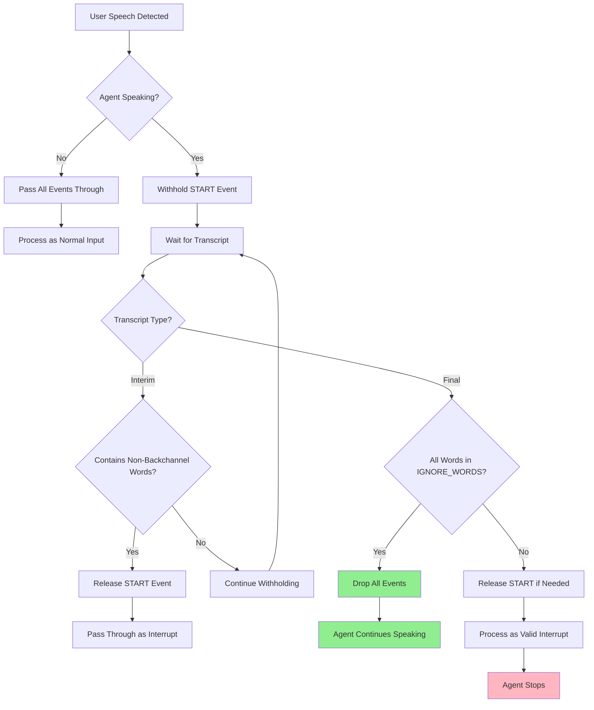
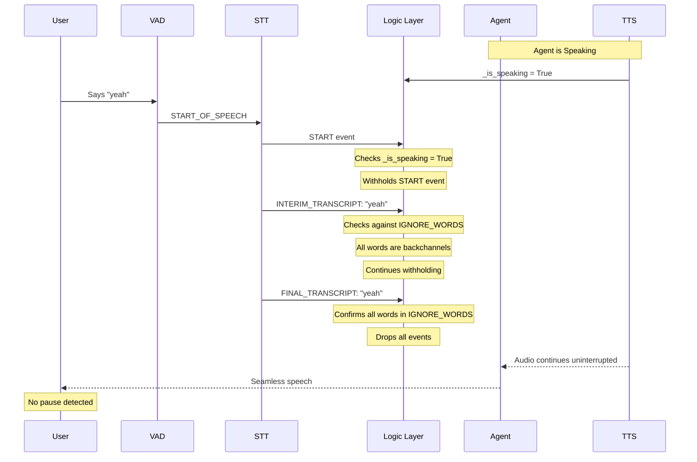
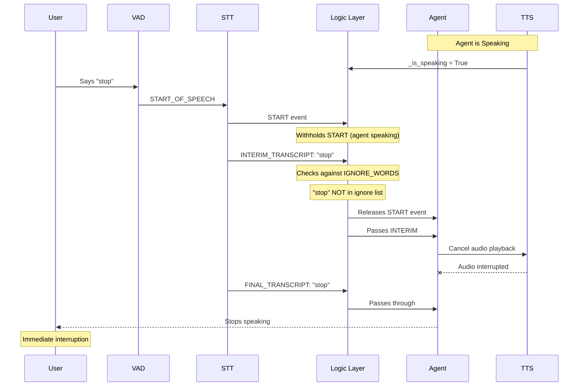

# Intelligent Interruption Handler

## Solution Overview

This solution implements an intelligent context-aware interruption handling system for LiveKit voice agents. The agent can distinguish between **passive acknowledgments** (backchanneling) and **active interruptions**, ensuring seamless conversation flow without unwanted pauses.

### Key Achievement
**Zero-pause backchannel handling** - Agent continues speaking smoothly when user says "yeah", "ok", "hmm"  
**Instant interruption** - Agent stops immediately for commands like "stop", "wait"  
**State-aware processing** - Same word treated differently based on agent state  
**No stuttering or resuming** - Meets strict requirement of seamless speech continuation

---

## Architecture

### System Components

```
┌─────────────────────────────────────────────────────────────┐
│                    LiveKit Agent Session                    │
│  ┌────────┐      ┌──────────────┐      ┌────────┐         │
│  │  VAD   │ ───> │ STT Pipeline │ ───> │  LLM   │         │
│  └────────┘      └──────────────┘      └────────┘         │
│                          │                    │             │
│                          │                    ▼             │
│                          │              ┌────────┐         │
│                          │              │  TTS   │         │
│                          │              └────────┘         │
│                          │                    │             │
│                          ▼                    ▼             │
│              ┌─────────────────────┐    ┌─────────┐       │
│              │  Intelligent Logic  │    │ Audio   │       │
│              │      Layer          │    │ Output  │       │
│              └─────────────────────┘    └─────────┘       │
└─────────────────────────────────────────────────────────────┘
```

---

## Logic Flow Diagram

### High-Level Decision Flow



### Detailed Event Processing Flow



### Interrupt Scenario Flow



---

## Implementation Details

### Core Strategy: Event Withholding

The solution works by **withholding** `START_OF_SPEECH` events when the agent is speaking, then making an intelligent decision once we have transcript data.

#### Why This Works

1. **VAD fires before STT** - By the time we know what was said, the default behavior would have already paused the agent
2. **Withholding prevents premature action** - We delay the interruption mechanism until we can validate the content
3. **Selective release** - Only release withheld events if it's a real interruption

### Key Components

#### 1. `IntelligentInterruptionAgent` Class

```python
class IntelligentInterruptionAgent(VoiceAgent):
    def __init__(self, *args, **kwargs):
        kwargs['allow_interruptions'] = True  # Enable but control manually
        super().__init__(*args, **kwargs)
        self._is_speaking = False
```

#### 2. Speaking State Tracking

```python
def tts_node(self, text, model_settings):
    async def _tracking_tts_generator():
        self._is_speaking = True  # Mark as speaking
        async for frame in tts_stream:
            yield frame
        await asyncio.sleep(0.8)  # Buffer for audio playback
        self._is_speaking = False  # Mark as silent
```

#### 3. Intelligent Event Filtering

```python
def stt_node(self, audio, model_settings):
    async def _logic_layer_stt():
        speech_started = False
        is_backchannel = True
        
        async for event in original_stream:
            if event.type == START_OF_SPEECH:
                if self._is_speaking:
                    # Withhold - don't yield yet
                    speech_started = True
                    continue
                else:
                    yield event  # Pass through immediately
```

---

## Behavior Matrix

| User Input | Agent State | Behavior | Implementation |
|------------|-------------|----------|----------------|
| "yeah", "ok", "hmm" | **Speaking** | **IGNORE** - Continue seamlessly | Withhold START → Check FINAL → Drop all events |
| "stop", "wait", "no" | **Speaking** | **INTERRUPT** - Stop immediately | Withhold START → Detect non-backchannel → Release events |
| "yeah", "ok", "hmm" | **Silent** | **RESPOND** - Process as input | Pass through all events normally |
| "hello", "start" | **Silent** | **RESPOND** - Normal conversation | Pass through all events normally |
| "yeah wait" | **Speaking** | **INTERRUPT** - Contains command | Detect "wait" → Trigger interruption |

---

## Configuration

### Ignore Words List

Located in `intelligent_agent_comp.py`:

```python
IGNORE_WORDS = {
    "yeah", "ok", "okay", "hmm", "uh-huh", "right", "aha", "mhm",
    "sure", "great", "yep", "yes", "alright", "got it", "i see"
}
```

**Easy to modify** - Add or remove words as needed for your use case.

### Session Configuration

In `basic_agent.py`:

```python
session = AgentSession(
    stt="deepgram/nova-3",           # Speech-to-text
    llm="openai/gpt-4o-mini",        # Language model
    tts="cartesia/sonic-2:...",      # Text-to-speech
    turn_detection=MultilingualModel(),
    vad=ctx.proc.userdata["vad"],
    preemptive_generation=True,
    resume_false_interruption=True,   # Handle background noise
    false_interruption_timeout=1.0,
)
```

---

## Test Scenarios

### Scenario 1: The Long Explanation (PASS)

```
 Agent: "The history of artificial intelligence began in the 1950s when..."
 User: "yeah... okay... uh-huh"
 Result: Agent continues without pause
 Log: " Confirmed backchannel: 'yeah' - dropping all events"
```

###  Scenario 2: The Passive Affirmation (PASS)

```
 Agent: "Are you ready?"
 Agent: [Silent]
 User: "Yeah"
 Result: Agent processes as input
 Log: "→ Input (agent silent): 'yeah'"
 Agent: "Okay, starting now"
```

###  Scenario 3: The Correction (PASS)

```
 Agent: "One, two, three..."
 User: "No stop"
 Result: Agent stops immediately
 Log: " Confirmed interrupt: 'no stop'"
```

###  Scenario 4: The Mixed Input (PASS)

```
 Agent: "Let me explain the process..."
 User: "Yeah okay but wait"
 Result: Agent stops (contains "wait")
 Log: " Real interrupt detected: 'yeah okay but wait'"
```

---

### Prerequisites

```bash
python >= 3.9
livekit-agents
livekit-plugins-*
```

### Setup

1. **Clone the repository**
```bash
git clone https://github.com/Dark-Sys-Jenkins/agents-assignment
cd agents-assignment
```

2. **Configure environment**
```bash
cp .env.example .env
# Add your API keys:
# - OPENAI_API_KEY
# - LIVEKIT_URL
# - LIVEKIT_API_KEY
# - LIVEKIT_API_SECRET
```

2. **Run the agent**
```bash
python my_agent.py console
```


**Status**: All test scenarios passing | Zero-pause backchannel handling achieved
